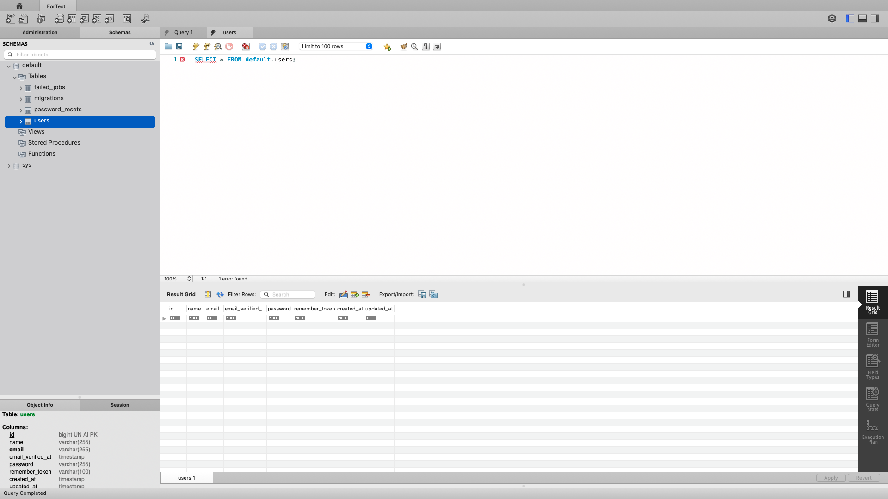

# laradock multi projects 🚀🐳


## create `test_laravel` project
- `composer create-project laravel/laravel test_laravel --prefer-dist`

## project structure
*****************
└laradock
└test_laravel
└project-2
*****************

## project `laradock`
- copy from `default.conf` to `test_laravel.conf`
- add `127.0.01  test_laravel.test` in `sudo vim /etc/hosts`
- copy from `.env.example` to `.env`
- in `.env`:

### db
```shell
MYSQL_DATABASE=default
MYSQL_PORT=3306
MYSQL_ROOT_PASSWORD=root
MYSQL_ENTRYPOINT_INITDB=./mysql/docker-entrypoint-initdb.d // Ex: laradock/mysql/docker-entrypoint-initdb.d/createdb.sql.example
```
### project path
- `APP_CODE_PATH_HOST=../`
>in case just only 1 project:
>- `APP_CODE_PATH_HOST=../test_laravel/`

### php
- `PHP_VERSION=7.4`

## project `test_laravel`
- copy from `.env.example` to `.env`
- in `.env`:

### db
```shell
DB_HOST=mysql
DB_PORT=3306
DB_DATABASE=default
DB_USERNAME=root
DB_PASSWORD=root
```

## deploy
1. `laradock# docker-compose up -d nginx mysql phpmyadmin redis workspace`
2. access on browser `test_laravel.test/public/index.php`

3. `laradock# docker-compose exec (--user=laradock) workspace bash`
4. `cd test_laravel`
5. `/var/www/test_laravel# php artisan migrate`
access on browser `test_laravel.test:8081` > login with these info:
```shell
MYSQL_HOST=mysql
MYSQL_USERNAME=root
MYSQL_PASSWORD=root
```

*****************
